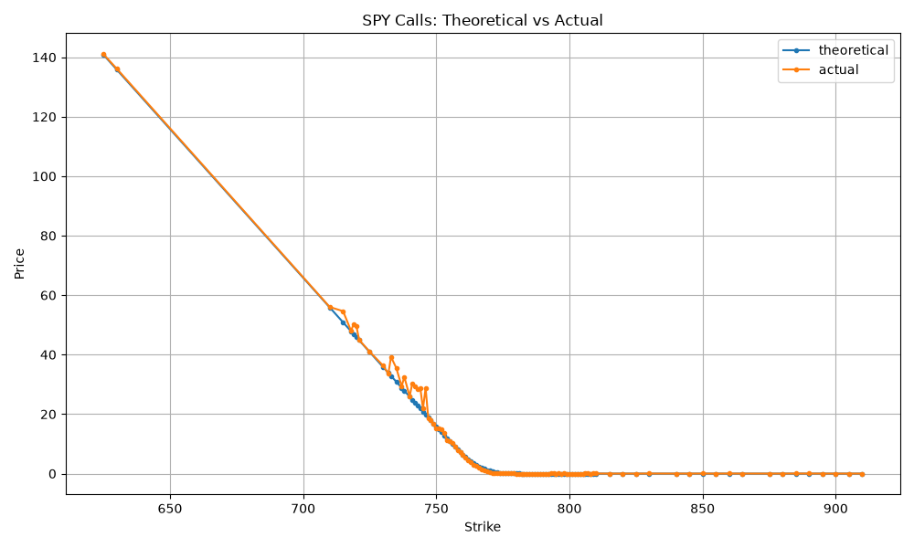
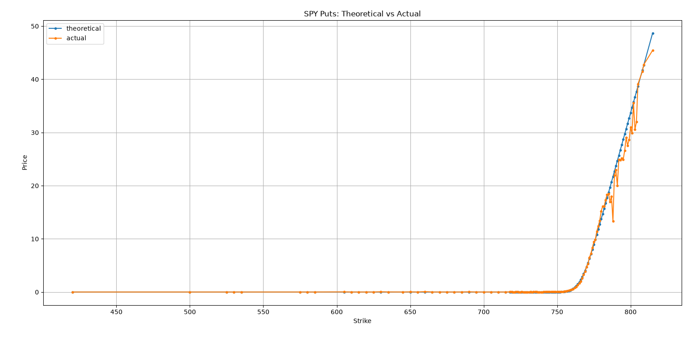
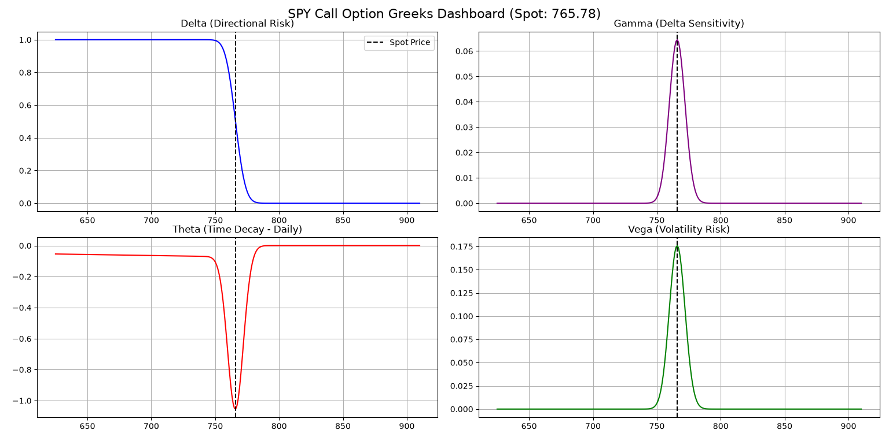

# SPX Options Pricer

Prices S&P 500 options (via the SPY ETF) against a Black-Scholes theoretical
model, and plots the Greeks (Delta, Gamma, Theta, Vega) across the strike
chain for the nearest-plus-one expiry.

## Why SPY, not ^GSPC

The S&P 500 index itself (`^GSPC`) doesn't carry a tradable option chain in
`yfinance` — index options (SPX) trade on a separate ticker structure that
isn't reliably available through the library. `SPY`, the S&P 500 ETF, has a
deep, liquid chain and tracks the index closely (roughly 1/10th the index
level), so it's used here as the practical proxy. The ticker is a CLI flag,
so you can point this at any optionable symbol.

## Structure

```
spx-options-pricer/
├── main.py              # CLI entry point, orchestrates the workflow
├── src/
│   ├── data.py           # price history, realized vol, option chain, risk-free rate
│   ├── pricing.py        # Black-Scholes price + Greeks (with dividend yield)
│   └── plotting.py       # theoretical-vs-actual and Greeks dashboard plots
├── tests/
│   └── test_pricing.py   # pricing engine checked against known BS reference values
├── requirements.txt
└── .gitignore
```

## Setup

```bash
pip install -r requirements.txt
```

## Usage

```bash
python main.py
```

Optional flags:

```bash
python main.py --symbol SPY --expiry-index 1 --vol-window 60 --dividend-yield 0.013
```

- `--symbol` — any optionable ticker (default `SPY`)
- `--expiry-index` — which expiry to use from `ticker.options` (0 = nearest)
- `--vol-window` — trading days of history used for realized volatility
  (default 60; a shorter window tracks current conditions better than using
  the full multi-year history for a near-dated option; must be at least 2)
- `--dividend-yield` — continuous dividend yield used in the Black-Scholes
  formula (SPY's trailing yield is roughly 1.3%, but check current values)

## Running tests

```bash
pytest tests/
```

## Known limitations (by design, not bugs)

- **American vs. European.** SPY options are American-style; this model
  prices European options. Expect a gap between theoretical and actual
  prices — especially for puts — from the early-exercise premium that
  Black-Scholes doesn't capture. Treat the theoretical curve as a
  benchmark, not a fair-value target.
- **Realized vs. implied volatility.** `sigma` here is historical realized
  volatility over a configurable trailing window, not the market's implied
  volatility. It will diverge from actual pricing during volatile or
  fast-changing regimes.
- **Risk-free rate.** Pulled live from `^TNX` (10Y Treasury yield) with a
  hardcoded fallback if that fetch fails — check `get_risk_free_rate()` if
  numbers look stale.
- **Expiry time.** Time to expiry is measured to 4:00 PM New York time on
  the listed expiry date. The exact cutoff can differ for some contracts.

  ## Example Output

**Terminal Output:**
```text
SPY | Spot: 766.21 | Vol (60d): 14.01% | Rate: 4.76% | Expiry: 2026-09-01 | T: 0.0033y
```
**Theoretical vs. Actual Pricing (Calls):**
*(Notice the gap caused by the early-exercise premium of American options versus our European Black-Scholes model).*



**Theoretical vs. Actual Pricing (Puts):**



**The Greeks Dashboard (Risk Metrics):**



## Disclaimer
**Not Financial Advice:** This project is for educational and informational purposes only. The Black-Scholes theoretical prices and Greeks calculated by this tool do not constitute financial advice, an investment recommendation, or an offer to buy or sell any security.
